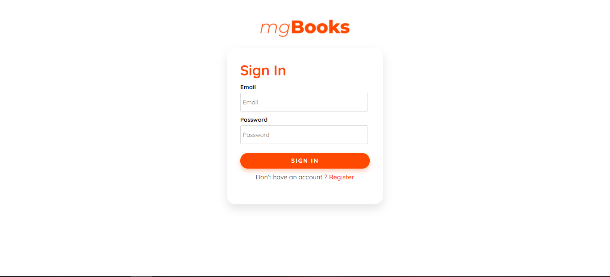

# Book E-Commerce Website

I build this with the following features, shopping cart, payment using PayPal, order history,login and register page etc.

You can check the web below here [MG Store](https://mgbooks.netlify.app/).

### Overview

#### - Login and Register Page

#### - Home Page

#### - Search Page

#### - Details Page

#### - Cart Page

#### - Shipping Page

#### - Place Order Page

#### - Payment Page

Note: This is just a test payment not a real payment

